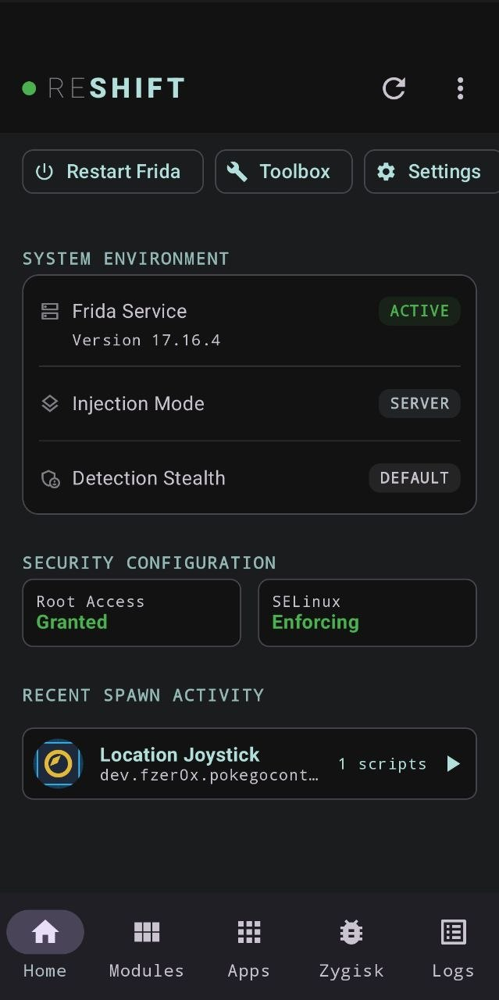

# 🐍 ReShift

**ReShift** is an advanced, high-performance Android security research, dynamic analysis, and reverse engineering suite. It unites the power of **Frida**, **Zygisk**, **C++ JNI On-Device GGUF LLM inference** (`llama.cpp`), **SQLite IL2CPP Inspector**, and **anti-detection stealth mechanics** into a mobile-first Jetpack Compose Material 3 interface.

<p align="center">
  
</p>

---

## 🚀 Key Features & Capabilities

### 🎮 IL2CPP Unity Inspector & Dumper
Deep reverse engineering suite for Unity Android games utilizing the IL2CPP scripting backend:
- **Native Metadata Extraction**: Direct extraction of metadata from `libil2cpp.so` and `global-metadata.dat`.
- **SQLite Database Engine (`il2cpp_dumper.db`)**: Persistent local SQLite caching of all parsed C# metadata for instant offline reloads and rapid search.
- **Dashboard Overview Metrics Banner**: Real-time display of total parsed C# classes, active target application, and database engine status.
- **Unified Control Center**: Target app selection, icon previews, and a configurable Frida injection delay slider (0 to 30 seconds) with quick preset chips (`0s`, `3s`, `5s`, `7s`, `10s`, `15s`, `20s`).
- **Search & Filtering Toolbar**: Real-time filtering across class names, namespaces, methods, fields, and RVA offsets.
  - Filter by type: `All`, `Classes`, `Structs`, `Interfaces`, `Enums`.
  - **Prune DB**: One-click database cleaning to strip compiler-generated internal noise and anonymized classes.
- **Interactive Class Cards & Multi-Tab Detail View**:
  - Color-accented headers for Class, Struct, Interface, and Enum types.
  - **Methods Tab**: Displays return types, parameters, RVA offsets, and pointer addresses with inner filters (`All`, `With Offset`, `Getters/Setters`). Includes one-touch `HOOK` snippet generation, offset copying, and AI Assistant triggers.
  - **Fields Tab**: Memory offsets, field types, and field names.
  - **Properties Tab**: Declared C# properties with `{ get; set; }` badges.
  - **C# Code View**: Renders auto-generated C# pseudocode stubs in a high-tech dual-scrolling code preview with line numbers and one-click copy.
- **Full Dump Export**: Export complete metadata dumps to structured JSON or C# Header (`.cs`) files.

---

### 🤖 ReShift Autonomous AI Agent & LLM Router
Integrated artificial intelligence for Frida script generation, closed-loop auto-correction, and game modification:
- **Multi-Provider LLM Router (`AdaptiveLlmRouter`)**:
  - **Gemini Cloud**: Integrates Google Gemini 3.6 Flash and 3.5 Flash Lite via `GeminiApiService`.
  - **Ollama Server**: Connects to local or network Ollama instances (`http://127.0.0.1:11434` or PC IP) via `OllamaApiService`.
  - **On-Device GGUF (Local Inference)**: Native C++ JNI bridge (`libreshift_llama.so` via `llama.cpp`) executing local GGUF models directly on the device GPU/CPU.
  - Preset models: Qwen 2.5 Coder 1.5B Instruct, Qwen 2.5 Coder 3B Instruct (Uncensored), and Qwen 2.5 Coder 7B Instruct (Uncensored).
- **GGUF Backup & Restore**: Flexible, case-insensitive, recursive search across `/Download` and `/Downloads` (and subfolders like `ReShift_LLM_Models`) with Root Shell (`su`) `find` and `cp` fallbacks for Scoped Storage compatibility on Android 10+.
- **Autonomous Closed-Loop Agent Loop**:
  - **Full-Screen Agent Interface**: Complete orchestration modal with live execution tracking.
  - **Telemetry & Hardware Dashboard**: Monitors free RAM, inference latency (ms), and toggles between CPU ARM64 NEON and Vulkan GPU acceleration.
  - **Goal Presets**: One-tap setup for `Anti-Cheat Bypass`, `God Mode & HP`, `Unlimited Money`, or custom user instructions.
  - **Live Generator Stream**: Dual-scrolling real-time code stream showing tokens generated by the LLM.
  - **Visual Process-Timeline Stepper**: Highlights pipeline stage (`Build Prompt` ➔ `Inference` ➔ `Pre-Audit` ➔ `Inject` ➔ `Dual-Stream Monitor` ➔ `Success/Repair`).
  - **Multi-Tab Inspection Suite**: *Terminal Log*, *Frida Live Console*, and *sql.db AST Context*.
  - **Interactive User Evaluation Overlay**: Modal decision prompt for validating in-game results, with optional prompt refinement input for iterative self-correction.
  - **Agent Configuration**: Execution modes (`Auto`, `Spawn (-f)`, `Attach (-n)`), injection delay slider, and optional Cloud Static Analysis Validation.

---

### 🥷 Anti-Detection & Stealth Suite
Engineered to bypass modern anti-cheat and detection mechanisms:
- **Dynamic Binary Renaming**: Automatically renames Frida binaries (e.g., `frida-server` ➔ `nm-service` / randomized names) to evade process name checks (`pgrep`, `/proc/self/cmdline`).
- **Stealth Pathing**: Operates out of hidden, root-protected system directories (`/data/adb/modules/snakeloader_frida`).
- **Port Randomization**: Configurable non-standard communication ports to avoid detection of default Frida port 27042.
- **Kernel & Security Control**: Dynamic toggling of SELinux policies (`Enforcing` / `Permissive`) and Ptrace Scope (`yama/ptrace_scope`).
- **App Icon Masking**: Mask app icon in launcher as "System Storage" or hide completely.

---

### 🛠️ Dual-Engine Injection Architecture
- **Zygisk Loader**: Native C++ module (`zygisk/arm64-v8a.so`, `zygisk/armeabi-v7a.so`) that injects `frida-gadget.so` at process spawn before app `main()` execution.
- **Frida Server / CLI**: Full support for standard Frida instrumentation with configurable binary execution strategies (`Auto`, `RPC (CLI)`, `Inject`, `Server`).

---

### 🔍 Research & Debugging Arsenal
- **Memory Inspector**: Browse, dump (hex/ASCII), and write to process memory in real-time with RPC hook management.
- **Code Flow Stalker**: Instruction-level execution tracing, call hierarchy segment trees, and hot-path frequency analysis.
- **Interactive Root Shell**: Live `su` terminal console for executing commands directly on the device.
- **Process & Module Manager**: Inspect running processes, PIDs, loaded `.so` shared libraries, and terminate processes.
- **Live Floating Overlays (`OverlayService`)**: Monitor Script logs, Logcat buffers, and Frida CLI output directly over target applications.

---

### 📦 Ecosystem & Script Management
- **GitHub & Frida CodeShare Browsers**: Search, preview, and download thousands of community scripts.
- **ReShift Modules Asset Gallery**: Pre-bundled local asset script repository (`ReShiftModules`).
- **Multi-Script Loader**: Concatenate and manage multiple active scripts per app with priority execution.
- **Built-in Script Editor**: Monospace syntax editor for on-device script modification.

---

## 🏗️ Project Architecture

```
ReShift/
├── app/                        # Android Application (Jetpack Compose M3 UI, ViewModels, Koin DI)
│   ├── src/main/cpp/           # C++ Native JNI Bridge (llama-bridge.cpp for GGUF LLM inference)
│   └── src/main/java/ox/fzer0x/snakeloader/
│       ├── ai/                 # Autonomous Agent Engine, Router, GGUF Engine & AST Ranker
│       ├── db/                 # SQLite Database Helpers (il2cpp_dumper.db)
│       ├── network/            # Ktor Services for Gemini & Ollama APIs
│       ├── security/           # Encryption, Certificate Pinner & Security State
│       ├── ui/                 # Material 3 Screens, ViewModels & Custom Components
│       └── utils/              # ShellExecutor (su), Process Monitor, Stealth Utils
├── MagiskModule/               # Distribution Magisk/KSU/APatch Module
│   ├── service.sh              # Background startup script
│   ├── customize.sh            # Module installer script
│   ├── frida-server / inject   # Pre-bundled Frida binaries (17.18.0)
│   └── zygisk/                 # Compiled Zygisk native loader libraries
└── ZygiskModuleScr/            # Zygisk C++ loader source code
```

---

## 📜 Changelog

### [1.1.1] - Maintenance & Engine Upgrades

#### 📦 Frida Engine & Binaries Upgrade
- **Frida v17.18.0 Upgrade**:
  - Updated bundled Magisk/KernelSU/APatch module binaries (`frida-server`, `frida-inject`, `frida-gadget.so`) from 17.16.4 to **17.18.0**.
  - Synchronized embedded app assets (`app/src/main/assets/ReShift.zip`) to bundle Frida 17.18.0 natively for direct in-app module installations.
  - Updated `module.prop` and version metadata.

#### 📱 Launcher & Manifest Fixes
- **Duplicate App Icon Fix**:
  - Resolved double launcher icon issue when running `./gradlew installRelease`.
  - Removed duplicate `LAUNCHER` intent filter from `MainActivity` in `AndroidManifest.xml`.
  - Unified app launcher management exclusively through `.LauncherDefault` and `.LauncherMasked` activity aliases for stealth icon masking.

#### 🤖 LLM Model Restoration Enhancements
- **Enhanced GGUF Restoration Path Search**:
  - Upgraded `restoreGgufModelsFromDownloads` in `SettingsViewModel.kt` to dynamically resolve `/Download` and `/Downloads` directories using official `Environment` APIs.
  - Resolved Android Lint warning regarding hardcoded `/sdcard/` paths.

---

### [1.1.0] - Design System & Feature Overhaul

#### 🎨 Unified Design System & UI/UX Redesign
- **Design System Tokens (`ui/theme/` & `ui/components/CommonUI.kt`)**:
  - **Standardized Shape Tokens**: Established `ReShiftCardShape` (`16.dp`), `ReShiftDialogShape` (`20.dp`), `ReShiftButtonShape` (`12.dp`), `ReShiftChipShape` (`8.dp`), and `ReShiftBadgeShape` (`6.dp`).
  - **Semantic Color Tokens**: Added unified status colors in `Color.kt` (`SuccessGreen`, `ErrorRed`, `WarningOrange`, `InfoBlue`, `PurpleAccent`, `CyanAccent`).
  - **Brand TopAppBar (`ReShiftTopAppBar`)**: Standardized top app bar with `"RE"` + `"SHIFT"` brand mark and active status dot on main screens, and clean back navigation on detail screens.
  - **Reusable Components**:
    - `ReShiftCard`: Unified card wrapper with consistent padding, shape, and border tokens across all screens.
    - `SectionHeader`: Bold uppercased section headers with uniform typography and letter spacing (`1.2.sp`).
    - `StatusBadge` & `StatusRow`: Standardized key-value indicators and status pills.
    - `BadgePill`: High-tech monospace code and type badges.
- **Complete Screen Harmonization**:
  - Refactored all 17 screens and sub-screens (`StatusScreen`, `AppsScreen`, `ModulesScreen`, `LogsScreen`, `SettingsScreen`, `FridaToolboxScreen`, `Il2CppScreen`, `MemoryInspectorScreen`, `ZygiskSettingsScreen`, `StalkerToolboxScreen`, `AdvancedFridaScreen`, `AppDetailsScreen`, `ModuleDetailsScreen`, `ScriptEditorScreen`, `RepoBrowserScreen`, `CodeShareBrowserScreen`, `AssetBrowserScreen`).
  - Standardized all application dialogs (`AppUpdateDialog`, `CommunityDialog`, `AppPickerDialog`, `MemoryDumpDialog`, `MemoryWriteDialog`, etc.).

#### 🎮 IL2CPP Inspector (Unity Game Reverse Engineering)
- **Metadata Dumping & SQLite Caching**:
  - Native dump extraction from `libil2cpp.so` and `global-metadata.dat`.
  - Automatic persistent SQLite caching in `il2cpp_dumper.db` for instant reloads and offline analysis.
- **Dashboard Overview Metrics Banner**:
  - Real-time display of total parsed C# classes, active target application, and database engine status.
- **Unified Control Center**:
  - Target application picker with app icon preview and package details.
  - Configurable Frida injection delay slider (0 to 30 seconds) with quick preset chips (`0s`, `3s`, `5s`, `7s`, `10s`, `15s`, `20s`).
  - Actions for *Launch & Inspect* and *Cached Dump* loading.
- **Search & Filter Toolbar**:
  - Real-time text search across class names, namespaces, methods, fields, and RVA offsets.
  - Type filter chips: `All`, `Classes`, `Structs`, `Interfaces`, `Enums`.
  - `Prune DB`: One-click database cleaning to eliminate noise and compiler-generated internal entries.
- **Interactive Class Cards & Multi-Tab Details**:
  - Color-accented class headers (Green = Class, Blue = Interface, Purple = Struct, Orange = Enum).
  - Quick actions per class: Copy C# pseudocode stub, Hook All Methods, and expand/collapse details.
  - **Tab 1: Methods**:
    - Displays method name, return type badge, parameters, RVA offset, and pointer address.
    - Inner filter options (`All`, `With Offset`, `Getters/Setters`).
    - Quick actions: `HOOK` code snippet generator, copy offset to clipboard, and AI Assistant trigger.
  - **Tab 2: Fields**:
    - Displays field type, field name, and memory offset badge.
  - **Tab 3: Properties**:
    - Displays declared C# properties with `{ get; set; }` badges.
  - **Tab 4: C# Code View**:
    - Renders auto-generated C# pseudocode stubs in a high-tech dual-scrolling code preview with line numbers and one-click copy.
- **Export Capabilities**:
  - Export full metadata dumps as structured JSON or C# Header files (`.cs`).

#### 🤖 ReShift Autonomous AI Agent & LLM Engine
- **Multi-Provider LLM Support**:
  - **Gemini Cloud**: Integrates Gemini 3.6 Flash and 3.5 Flash Lite via Google Gemini API.
  - **Ollama Server**: Connects to local/network Ollama instances (`http://127.0.0.1:11434` or PC IP).
  - **On-Device GGUF (Local Inference)**: Executes GGUF models directly on the phone via JNI `libreshift_llama.so` C++ backend.
  - Preset models: Qwen 2.5 Coder 1.5B Instruct, Qwen 2.5 Coder 3B Instruct (Uncensored), and Qwen 2.5 Coder 7B Instruct (Uncensored).
- **GGUF Backup & Restore**:
  - Flexible, case-insensitive, recursive search across `/Download`, `/Downloads`, and subfolders (e.g., `RESHIFT_LLM_MODELS`, `ReShift_LLM_Models`).
  - Root Shell (`su`) `find` and `cp` fallbacks for 100% reliable model restoration under Scoped Storage restrictions on Android 10+.
- **Autonomous Closed-Loop Reverse Engineering Agent**:
  - **Full-Screen Agent Interface**: Complete orchestration modal with live execution tracking.
  - **Telemetry & Hardware Dashboard**: Displays free RAM, total RAM, inference latency (ms), and toggles between CPU NEON and Vulkan GPU acceleration.
  - **Goal Presets & Custom Instructions**: One-tap goal setup (`Anti-Cheat Bypass`, `God Mode & HP`, `Unlimited Money`) or custom reverse engineering instructions.
  - **Live Generator Stream**: Dual-scrolling code view showing live token generation in real time.
  - **Visual Process-Timeline Stepper**: Highlights current loop stage (`Build Prompt` ➔ `Inference` ➔ `Pre-Audit` ➔ `Inject` ➔ `Dual-Stream Monitor` ➔ `Success/Repair`).
  - **Multi-Tab Inspection Suite**:
    - *Terminal Log*: Color-coded step-by-step agent activity log.
    - *Frida Console*: Live runtime output and console logs from Frida script execution.
    - *sql.db AST Context*: Inspection of SQLite metadata queried by the agent.
  - **Interactive User Evaluation Loop**:
    - Modal decision pop-up asking if the reverse engineering goal was achieved in-game.
    - Prominent YES/NO actions with optional prompt refinement input for iterative self-correction.
  - **Agent Configuration**:
    - Execution mode selection (`Auto`, `Spawn (-f)`, `Attach (-n)`).
    - Adjustable injection delay slider (0 to 60 seconds).
    - Optional Cloud Static Analysis Validation.

---

## 🚦 Getting Started

1. **Prerequisites**: A rooted Android device running Magisk, KernelSU, or APatch.
2. **Flash the ReShift Module**: Flash the `ReShift.zip` module via Magisk / KSU / APatch Manager.
3. **Configure Zygisk**: Enable Zygisk in your root manager and configure target apps in the ReShift UI.
4. **Download LLM Models (Optional)**: In Settings, download an On-Device GGUF model (Qwen 1.5B / 3B / 7B) or configure a Gemini API key / Ollama server for AI-assisted reverse engineering.
5. **Inspect & Instrument**: Use the IL2CPP Inspector, Frida Toolbox, or Autonomous AI Agent to analyze and modify target applications.

---

## 📜 License & Disclaimer

This tool is created for educational, security research, and authorized testing purposes only.

> [!CAUTION]
> Reverse engineering applications may violate their Terms of Service. Use this tool responsibly and ethically.
